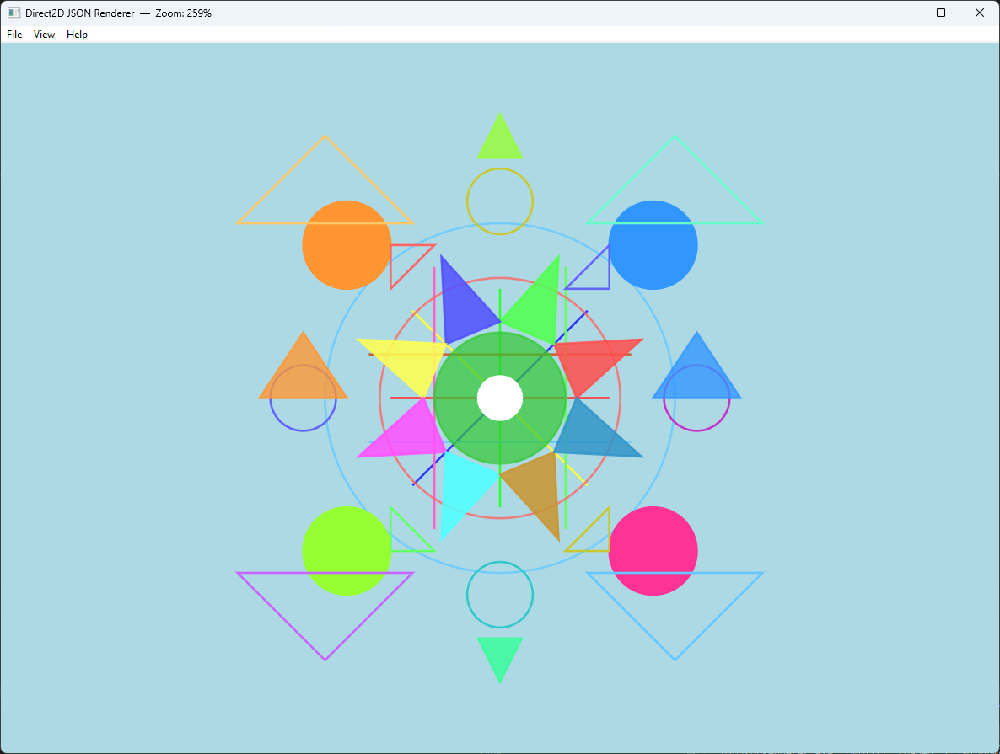

# Direct2D JSON Scene Renderer

A lightweight 2D vector graphics renderer implemented in **C++ using Direct2D**.

The application loads a scene description from a JSON file and renders basic geometric primitives such as lines, circles, and triangles.

---

## Screenshot



---

## Features

- Load scene from JSON file
- Render:
  - Lines
  - Circles
  - Triangles (with optional fill)
- Hardware-accelerated rendering via Direct2D
- Coordinate system transformation (Cartesian → screen space)
- Automatic scaling to fit the viewport
- Clean and modular structure

---

## How to Run

1. Open the solution in **Visual Studio 2022**
2. Build the project (x64 / Debug or Release)
3. Run the application
4. Load `TestData.json` or your own scene file

---

## Architecture Overview

The project is organized into several logical components:

### Core / Domain
- Primitive definitions:
  - `LinePrimitive`
  - `CirclePrimitive`
  - `TrianglePrimitive`
- Color representation (`ArgbColor`)

---

### Rendering

- Direct2D-based rendering pipeline
- Uses:
  - `ID2D1Factory`
  - `ID2D1HwndRenderTarget`
  - Brushes for drawing primitives

Each primitive is responsible for its own rendering logic.

---

### Transformation

- `CoordinateTransformer`
  - Converts Cartesian coordinates (Y-up)
  - Into screen coordinates (Y-down)
  - Applies scaling and offset

---

### Scene Loading

- JSON parsing via `nlohmann::json`
- `JsonSceneLoader`:
  - Reads scene file
  - Instantiates primitives
  - Builds in-memory scene representation

---

## Rendering Details

The renderer performs:

- Coordinate system conversion (mathematical → screen)
- Uniform scaling to fit the window
- Centering of the scene
- Drawing primitives using Direct2D APIs

---

## Example JSON

```json
{
  "shapes": [
    {
      "type": "line",
      "x1": 0,
      "y1": 0,
      "x2": 100,
      "y2": 100,
      "color": "#FF0000"
    },
    {
      "type": "circle",
      "cx": 50,
      "cy": 50,
      "radius": 25,
      "color": "#00FF00"
    }
  ]
}